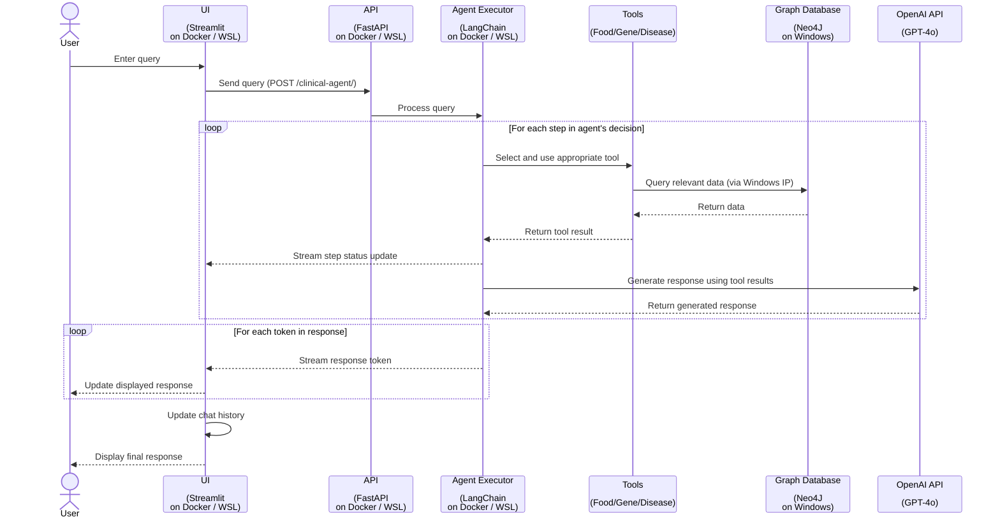

# Setting Up Clinical-Agent: A Journey Through Neo4j, WSL, and Docker

I recently embarked on a journey to showcase the functionality of the `clinical-agent` project. This project, which leverages a Neo4j graph database and a LangChain agentic application running in a Docker container, proved to be an enlightening experience due to my decision to run Docker on WSL2. In the end, the issues were not complicated; all that was needed to get things running smoothly were a number of small configuration changes to allow connectivity between WSL and the Neo4j database.

This work is based on the `clinical-agent` repo and GraphRAG presentation from Tomaz Bratanic.
- Repository: https://github.com/tomasonjo/clinical-agent
  - The Neo4j backed agents truly underscore the power of Cypher queries to retrieve valuable data from large healthcare databases.  [A sneak preview of the code here](https://github.com/tomasonjo/clinical-agent/tree/main/api/packages/neo4j-clinical-layer/neo4j_clinical_layer)
- Slides: [GraphRAG for LifeSciences](https://www.slideshare.net/slideshow/graphrag-for-life-science-to-increase-llm-accuracy/269616483)
- Neo4j Clinical Database dump (only 5 GB!): [clinical_neo4j_518.dump](https://drive.google.com/file/d/1r5mHYuDjl-ilB8_vqgCqMUnziqGbOete/view?usp=drive_link)

## DRAFT:  Sequence Model



## Prerequisites

- Windows 11, running Ubuntu on Windows Subsystem for Linux (WSL2)
- Docker - running on WSL2
- Neo4j Desktop - running on Windows 11
- Clinical Database dump file

## Step 1: Loading the Neo4j dump file in Neo4j Desktop

> Create a new Neo4j database based on the clinical_neo4j_518.dump file.

1. Create a new project in Neo4j Desktop
2. Add the dump file to the project: click on 'Add' button beside folder name
3. Create new DBMS from dump file: click on the ellipsis next to the dump file
   - Pick a meaningful password and use the defaults for the remaining settings
4. Install APOC Plugin: click on the DBMS name and then select the Plugins tab in the UI frame on the right

## Step 2: Validate the Neo4j database

> After creating the database use the Cypher queries in the Neo4j browser to validate the data.

1. Start the Database Management System (DBMS): from the project screen click on 'Start' next to the DBMS name
2. Open the Neo4j Browser: from the project screen click on 'Open' next to the DBMS name (opens a new window)
3. Query for Food-Metabolite-Disease Relationships: run the Cypher query in the Neo4j browser
   ```cypher
   MATCH (f:Food)-[r:HAS_CONTENT]->(m:Metabolite)-[r2:ASSOCIATED_WITH]->(d:Disease)
   WHERE d.name CONTAINS 'cancer'
   RETURN f.name AS name, m.name AS metabolite_name, d.name AS disease
   LIMIT 10
   ```
4. Query for Protein-Disease-Tissue Relationships:
   ```cypher
   MATCH (p:Protein)-[r:ASSOCIATED_WITH]-(d:Disease)
   WHERE d.name CONTAINS 'prostate carcinoma'
   OPTIONAL MATCH (p)-[r2:ASSOCIATED_WITH]->(t:Tissue)
   RETURN d.name AS disease, p.name AS drug_target, t.name AS expressed_tissue
   LIMIT 10
   ```
5. Query for Gene Variants:
   ```cypher
   MATCH(g:Gene)
   WHERE g.id =~ '(?i)' + 'CLN3'
   WITH g
   OPTIONAL MATCH (g)-[r:VARIANT_FOUND_IN_GENE]-(v:Known_variant)
   WHERE NOT v.clinical_relevance = '-' AND NOT v.disease = '-'
   RETURN g.id AS gene, v.disease AS disease, v.pvariant_id AS variant_id, v.clinical_relevance AS relevance
   LIMIT 20
   ```

## Step 3: Allow external access to your Neo4j DBMS

> Update DBMS neo4j.conf settings to allow your WSL system to access your database

1. Open folder that contains the configuration settings for your DBMS:
   - Click on the name of your DBMS, and then click on the ellipsis (...) that will appear beside the 'Open' button
   - Select Open folder --> Configuration: in the Windows Explorer window that opens, open the 'neo4j.conf' file with a text editor
2. Confirm the IP address of the Windows host that WSL2 will use to connect to the database: identifying the WSL2 IP address first helps to determine the appropriate Windows Host IP address to use
   ```bash
   # Run the following command in your WSL2 terminal to find the IP address assigned to the WSL2 instance:
   ip addr | grep eth0 | grep inet | awk '{print $2}' | cut -d'/' -f1

   # Run the following command in your WSL2 terminal to determine the Windows Host IP
   ip route | grep default | awk '{print $3}'
   ```
3. Update the DBMS neo4j.conf file: find the following lines in the config file and remove the comment at the start of the line ('#') if present.
   ```
   server.default_listen_address=0.0.0.0
   server.default_advertised_address=<Your Windows IP from above>
   ```
   NOTE: restart your DBMS after making configuration changes

## Step 4: Verify WSL2 connectivity to Neo4j database

> For cypher-shell installation instructions refer to the appendix below

1. Test Neo4j connectivity from WSL: you can use telnet if you prefer.
   ```bash
   nc -zv <Your Windows IP> 7687
   nc -zv <Your Windows IP> 7474
   ```
2. Connect to Neo4j using cypher-shell from WSL:
   ```bash
   cypher-shell -u neo4j -p <Your Neo4j DBMS Password> -a bolt://<Your Windows IP>:7687
   ```
3. Run a test query:
   ```cypher
   MATCH (g:Gene {id: 'CLN3'})
   RETURN g LIMIT 1;
   ```

## Step 5: Update .env settings for clinical-agent project

> Clone the client-agent repository and follow the instructions in the README
> Update the environment configuration file to match your Neo4j environment settings

1. Update Neo4j and OpenAI environment variables: use .env.example to create your .env file.
   ```
   NEO4J_URI=neo4j://<Your Windows IP>:7687
   NEO4J_PASSWORD=<Your Neo4j DBMS Password>
   NEO4J_USERNAME=neo4j
   OPENAI_API_KEY=<Your OpenAI API sk-proj- key>
   ```

## APPENDIX: Installing cypher-shell on Ubuntu

1. Add Neo4j repository:
   ```bash
   wget -O - https://debian.neo4j.com/neotechnology.gpg.key | sudo apt-key add -
   echo 'deb https://debian.neo4j.com stable latest' | sudo tee /etc/apt/sources.list.d/neo4j.list
   ```
2. Update package list:
   ```bash
   sudo apt update
   ```
3. Install cypher-shell:
   ```bash
   sudo apt install cypher-shell
   ```
4. Verify installation:
   ```bash
   cypher-shell --version
   ```

## Conclusion

Setting up the clinical-agent project was a journey filled with valuable lessons about Neo4j configuration, WSL networking, and Docker containerization. By following these steps and keeping the troubleshooting tips in mind, you should be able to get the project up and running smoothly.

Remember, the key to success lies in properly configuring Neo4j for external access, ensuring WSL can communicate with your Windows host, and correctly setting up your Docker environment. Happy coding, and may your clinical-agent project bring valuable insights to your healthcare data!